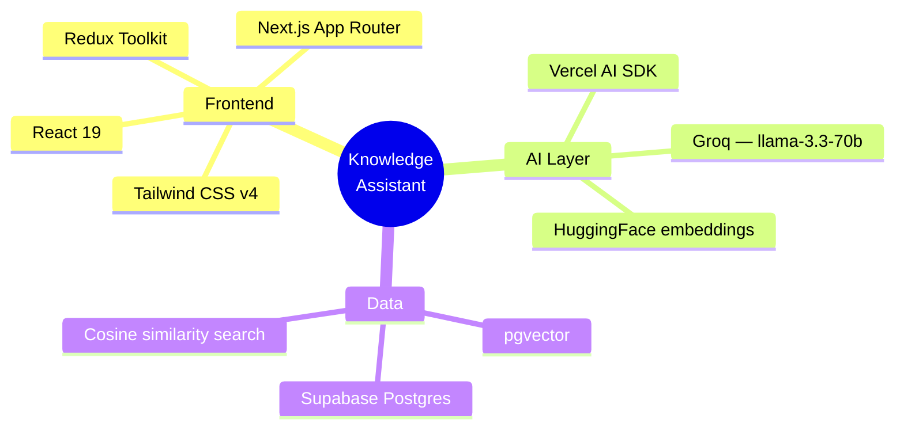
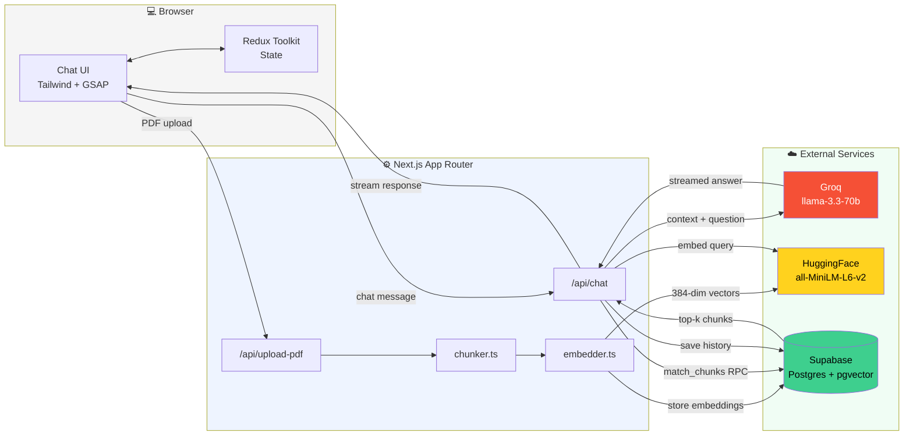
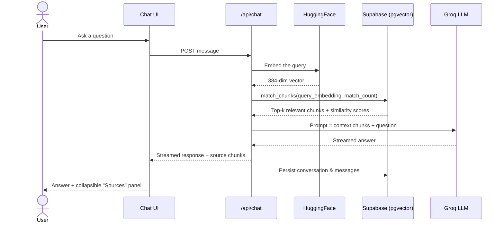

<div align="center">

# 🧠 Personal Knowledge Assistant

**Chat with your own documents.** A full-stack, AI-powered knowledge assistant using Retrieval-Augmented Generation (RAG) — upload PDFs, ask questions, get answers grounded in your own content.

Built with **Next.js 16**, **Vercel AI SDK v7**, **Supabase (`pgvector`)**, and **Groq** for blazing-fast inference.

[](https://nextjs.org/)
[](https://react.dev/)
[](https://groq.com/)
[](https://supabase.com/)
[](https://tailwindcss.com/)

</div>

---

## 📑 Table of Contents

- [Features](#-features)
- [Tech Stack](#️-tech-stack)
- [Architecture](#-architecture)
- [RAG Query Flow](#-rag-query-flow)
- [Getting Started](#-getting-started)
- [Project Structure](#-project-structure)
- [Contributing](#-contributing)

---

## 🚀 Features

| Feature | Description |
|---|---|
| 🔍 **RAG over your documents** | Chunks your PDFs, generates embeddings, and retrieves relevant context to answer questions accurately |
| ⚡ **Fast inference with Groq** | Uses `llama-3.3-70b-versatile` via Groq for high-speed, high-quality responses |
| 🧬 **Local-style embeddings** | HuggingFace Inference API (`sentence-transformers/all-MiniLM-L6-v2`) generates 384-dim vector embeddings |
| 🗄️ **Vector database** | Supabase + `pgvector`, queried via cosine similarity |
| 💾 **Conversation persistence** | Chat history saved in PostgreSQL — revisit past conversations anytime |
| 🎨 **Polished UI** | Tailwind CSS v4, GSAP animation, Markdown rendering for code blocks |
| 🔄 **State management** | Redux Toolkit for seamless client-side state handling |

---

## 🛠️ Tech Stack



| Layer | Choice |
|---|---|
| **Framework** | Next.js (App Router) & React 19 |
| **AI SDK** | Vercel AI SDK |
| **LLM** | Groq (`llama-3.3-70b-versatile`) |
| **Embeddings** | HuggingFace (`all-MiniLM-L6-v2`) |
| **Database** | Supabase (PostgreSQL + pgvector) |
| **Styling** | Tailwind CSS v4 |
| **State** | Redux Toolkit |

---

## 🏛️ Architecture



---

## 🔄 RAG Query Flow



---

## 📦 Getting Started

### 1. Clone the repository

```bash
git clone <your-repo-url>
cd personal-knowledge-assistant
```

### 2. Install dependencies

```bash
npm install
# or
yarn install
# or
pnpm install
```

### 3. Set up Supabase

1. Create a new project on [Supabase](https://supabase.com)
2. Enable the `pgvector` extension (via the Supabase dashboard)
3. Run the SQL in `setup-db.sql` to create the `conversations` and `messages` tables
4. **Important**: create the `chunks` table and `match_chunks` function:

```sql
-- Enable the pgvector extension to work with embedding vectors
create extension if not exists vector;

-- Create the chunks table
create table if not exists public.chunks (
  id bigint generated by default as identity primary key,
  text text not null,
  embedding vector(384),
  created_at timestamp with time zone default timezone('utc'::text, now()) not null
);

-- Create the vector search function
create or replace function match_chunks (
  query_embedding vector(384),
  match_count int default 5
)
returns table (
  id bigint,
  text text,
  similarity float
)
language sql stable
as $$
  select
    chunks.id,
    chunks.text,
    1 - (chunks.embedding <=> query_embedding) as similarity
  from chunks
  order by chunks.embedding <=> query_embedding
  limit match_count;
$$;
```

### 4. Configure environment variables

```bash
cp .env.example .env.local
```

| Variable | Description |
|---|---|
| `SUPABASE_URL` | `https://your-project-ref.supabase.co` |
| `SUPABASE_SERVICE_ROLE_KEY` | Your Supabase service role key |
| `GROQ_API_KEY` | Your Groq API key |
| `HUGGINGFACE_API_KEY` | Your HuggingFace API key |

> ⚠️ Do not commit `.env.local` to version control.

### 5. Run the development server

```bash
npm run dev
```

Open [http://localhost:3000](http://localhost:3000) to see it in action.

---

## 📂 Project Structure

```
personal-knowledge-assistant/
├── app/                    # Next.js App Router pages & API routes
│   └── api/chat/           # Chat endpoint
├── app/components/         # React UI components
└── lib/
    ├── embedder.ts         # HuggingFace embedding integration
    ├── supabase.ts         # DB connection & vector search functions
    ├── chunker.ts          # Document (PDF) chunking logic
    └── rate-limit.ts       # API rate limiting logic
```

---

## 🤝 Contributing

Contributions are welcome! Feel free to open an issue or submit a pull request if you have ideas for improvements or new features.

</div>
